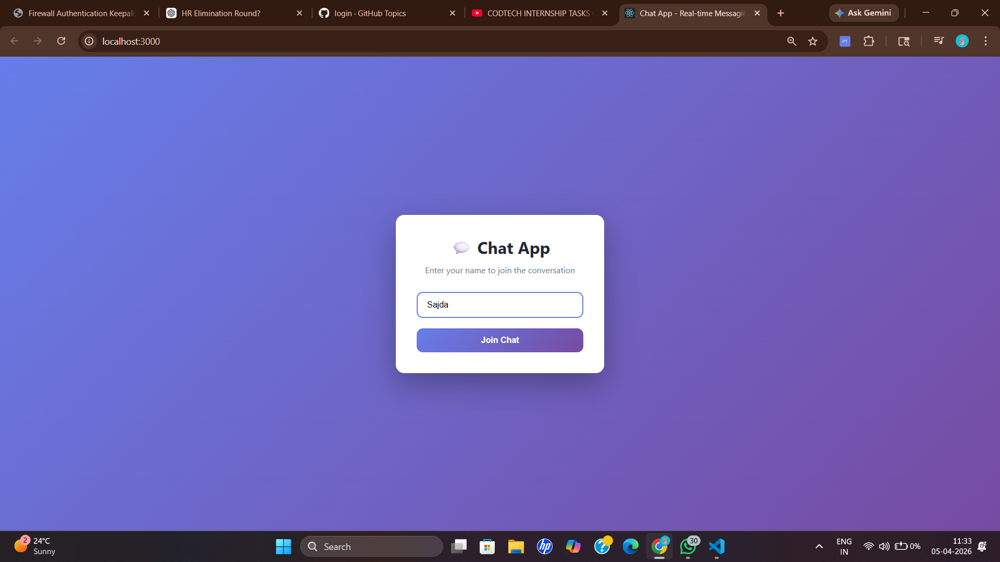
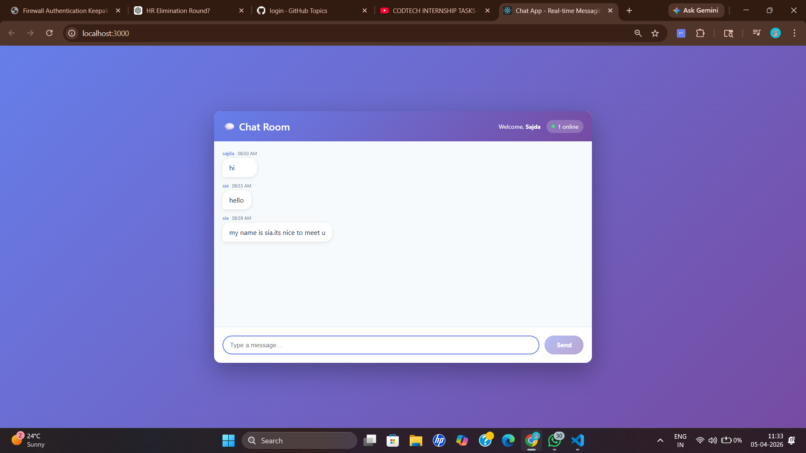

<<<<<<< HEAD
# Real-Time Chat Application

COMPANY: CODETECH IT SOLUTIONS
NAME: SAJDA SABNAM
INTERN ID: CTIS6245
DOMAIN: MERN STACK WEB DEVELOPMENT
DURATION: 8 WEEKS
MENTOR: NEELA SANTOSH

This project is a full-stack chat application built with React on the frontend and Node.js with Express and Socket.IO on the backend. It allows multiple users to join, send messages instantly, and see updates in real time. Message history is stored in MongoDB so conversations can persist between sessions. The app is designed as a practical learning project for real-time communication, client-server architecture, and modern JavaScript development workflows.

## Screenshots

The screenshots below are stored in the `screenshots/` folder at the project root.

### Gallery



Join screen shown when a user enters the chat.



Main chat interface showing messages and live activity.

Suggested screenshots to include:

- Join screen
- Main chat screen
- Typing indicator or active users view
- Mobile responsive view

If you add more screenshots later, place them in the same folder and add another image line here.

## What This Project Includes

The frontend lives in the client folder and provides the user interface for joining a chat and sending messages. The backend lives in the server folder and manages WebSocket events, user presence, and data persistence. Socket.IO connects both layers and keeps communication fast and event driven.

Main capabilities:

- Real-time messaging across connected users
- Join and leave notifications
- Active user updates
- Typing indicators
- Persistent message history with MongoDB
- Responsive user interface for desktop and mobile

## Technology Stack

Frontend:

- React
- Socket.IO Client
- CSS

Backend:

- Node.js
- Express
- Socket.IO
- Mongoose
- MongoDB

## Prerequisites

Install these tools before running the project:

- Node.js version 14 or newer
- npm
- MongoDB local installation or MongoDB Atlas

## Setup Steps

1. Open a terminal in the project root.
2. Install backend dependencies:

```bash
cd server
npm install
```

3. Install frontend dependencies:

```bash
cd ../client
npm install
```

4. Confirm backend environment settings in server/.env:

```env
PORT=5000
MONGODB_URI=mongodb://localhost:27017/chatapp
CLIENT_URL=http://localhost:3000
```

If you use MongoDB Atlas, replace MONGODB_URI with your cloud connection string.

## Run the Application

Start backend server in one terminal:

```bash
cd server
npm start
```

Start frontend app in another terminal:

```bash
cd client
npm start
```

After both services are running, open http://localhost:3000 in your browser.

## Project Structure

- server/config/db.js: MongoDB connection setup
- server/models/Message.js: message schema
- server/server.js: Express and Socket.IO server
- client/src/components/Join.js: user join screen
- client/src/components/Chat.js: main chat interface
- client/src/App.js: app container

## How It Works

When a user joins, the client emits a Socket.IO event to the server. The server tracks active users, broadcasts presence updates, and handles incoming messages. Each message is emitted to all connected clients and can be saved to MongoDB. Typing events are lightweight signals that notify others while someone is composing text.

## Troubleshooting

If messages are not loading, check that MongoDB is running and MONGODB_URI is valid. If the client cannot connect, verify that the backend is running on port 5000 and CLIENT_URL matches the frontend origin. If a port is busy, change the value in server/.env and restart both processes.
=======
# Real-Time-Chat-Application
>>>>>>> a9c90d7d66045107db003d3b3bc7ebe535dc1cf5
